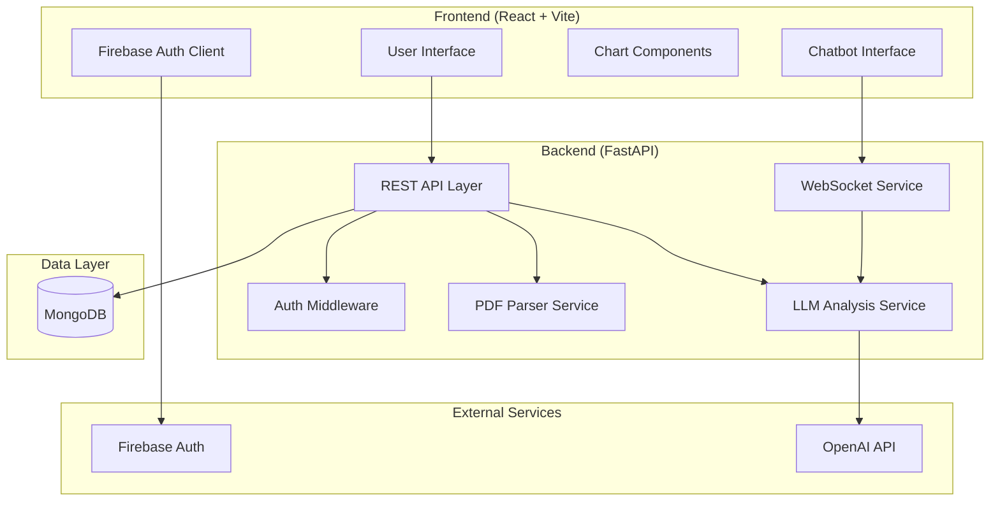

# Design Document: HealthInsightCore

## Overview

HealthInsightCore is a comprehensive medical test analysis web application built with a modern technology stack. The system enables patients to upload PDF medical test reports, receive AI-powered lifestyle advice, and track health metrics over time. Healthcare providers can manage patients and access their complete medical data through a dedicated interface.

The application follows a microservices-inspired architecture with clear separation between frontend and backend, utilizing Firebase for authentication, MongoDB for data persistence, and LLM integration for intelligent analysis.

## Architecture

### High-Level Architecture



### Technology Stack

**Frontend:**

- React 18 with TypeScript for type safety
- Vite for fast development and building
- Firebase Auth SDK for authentication
- Chart.js or Recharts for data visualization
- Socket.io-client for real-time communication
- Tailwind CSS for styling

**Backend:**

- FastAPI with Python 3.11+ for high-performance API
- Motor (async MongoDB driver) for database operations
- PyMuPDF (fitz) for PDF parsing and text extraction
- OpenAI API for LLM integration
- Socket.io for real-time WebSocket communication
- Pydantic for data validation and serialization

**Infrastructure:**

- MongoDB Atlas for cloud database hosting
- Firebase Authentication for user management
- Docker for containerization
- Environment-based configuration management

## Components and Interfaces

### Frontend Components

#### Authentication Components

- `LoginForm`: Handles user login with Firebase Auth
- `RegisterForm`: Manages user registration
- `AuthProvider`: Context provider for authentication state
- `ProtectedRoute`: Route wrapper for authenticated access
- `RoleBasedRoute`: Route wrapper with role-based access control

#### Patient Components

- `UploadPage`: PDF upload interface with progress tracking
- `ResultsPage`: Displays parsed test data and AI analysis
- `ReportHistory`: Archive view of all uploaded reports
- `Dashboard`: Time-series visualization of tracked metrics
- `ProfilePage`: User profile and settings management
- `ChatInterface`: AI chatbot for health queries

#### Hospital Components

- `PatientTable`: Searchable table of all registered patients
- `PatientDashboard`: Complete patient data view for hospitals
- `PatientSearch`: Advanced search and filtering capabilities

#### Shared Components

- `Chart`: Reusable chart component for data visualization
- `LoadingSpinner`: Loading state indicator
- `ErrorBoundary`: Error handling wrapper
- `NotificationSystem`: Toast notifications for user feedback

### Backend Services

#### API Layer (`/api/v1/`)

- `auth.py`: Authentication endpoints and middleware
- `patients.py`: Patient management endpoints
- `reports.py`: Report upload and retrieval endpoints
- `analysis.py`: AI analysis endpoints
- `chat.py`: Chatbot interaction endpoints
- `hospitals.py`: Hospital-specific endpoints

#### Core Services

- `PDFParserService`: Extracts structured data from medical PDFs
- `LLMAnalysisService`: Generates lifestyle advice using OpenAI API
- `DatabaseService`: MongoDB operations and data management
- `AuthService`: Firebase Auth integration and token validation
- `WebSocketService`: Real-time communication handling

#### Data Models (Pydantic)

```python
from enum import Enum
from typing import Any, Dict, List, Optional
from pydantic import BaseModel, ConfigDict, Field
from datetime import datetime

class UserType(str, Enum):
    PATIENT = "patient"
    INSTITUTION = "institution"

class UserModel(BaseModel):
    uid: Optional[str] = None
    user_type: Optional[UserType] = None

class PatientModel(UserModel):
    name: Optional[str] = None
    favorites: List[str] = []  # Tracked metrics/concerns
    bio_data: Dict[str, Any] = {}  # Height, weight, allergies, etc.
    reports: List[str] = []  # Report IDs
    model_config = ConfigDict(extra="allow")

class InstitutionModel(UserModel):
    name: Optional[str] = None
    patient_list: List[str] = []  # Patient IDs
    model_config = ConfigDict(extra="allow")

class MetricData(BaseModel):
    name: Optional[str] = None
    value: Optional[str] = None
    remark: Optional[str] = None
    range: Optional[str] = None
    unit: Optional[str] = None
    verdict: Optional[str] = None  # NORMAL | HIGH | LOW | CRITICAL

class Report(BaseModel):
    id: Optional[str] = Field(default=None, alias="_id")
    report_id: str = Field(..., description="Unique report identifier")
    patient_id: str = Field(..., description="Patient identifier")
    processed_at: datetime = Field(default_factory=datetime.utcnow)
    attributes: Dict[str, MetricData] = Field(..., description="Medical test results")
    llm_output: Optional[str] = Field(None, description="LLM-generated health assessment")
    llm_report_id: Optional[str] = Field(None, description="Reference to LLM analysis report")
    selected_concerns: Optional[List[str]] = None  # Metrics added to favorites

    class Config:
        populate_by_name = True

class LLMReportModel(BaseModel):
    patient_id: str = Field(..., min_length=1)
    report_id: str = Field(..., min_length=1)
    time: Optional[str] = None
    output: Dict[str, Any]  # AI analysis results
    input: Dict[str, Any]   # Original test data
    model_config = ConfigDict(extra="allow")

# Request/Response Models
class ReportCreate(BaseModel):
    report_id: str
    patient_id: str
    attributes: Dict[str, MetricData]
    llm_output: Optional[str] = None

class ReportUpdate(BaseModel):
    patient_id: Optional[str] = None
    attributes: Optional[Dict[str, MetricData]] = None
    llm_output: Optional[str] = None

class AttributeUpdateByName(BaseModel):
    name: str  # e.g. "BILIRUBIN, TOTAL"
    value: Optional[str] = None
    remark: Optional[str] = None
    range: Optional[str] = None
    unit: Optional[str] = None

class OnboardRequest(BaseModel):
    role: UserType  # "patient" or "institution"
    name: Optional[str] = None

class ChatMessage(BaseModel):
    role: str  # "user" | "assistant"
    content: str
    timestamp: datetime = Field(default_factory=datetime.utcnow)

class ChatSession(BaseModel):
    id: Optional[str] = Field(default=None, alias="_id")
    patient_id: str
    messages: List[ChatMessage] = []
    context: Dict[str, Any] = {}  # Recent reports, tracked metrics
    created_at: datetime = Field(default_factory=datetime.utcnow)
    updated_at: datetime = Field(default_factory=datetime.utcnow)
```

## Data Models

### Database Schema (MongoDB Collections)

#### Users Collection

```json
{
  "_id": "ObjectId",
  "uid": "string", // Firebase UID
  "user_type": "patient | institution",
  "name": "string",
  "favorites": ["string"], // For patients: tracked metrics
  "bio_data": {
    // For patients
    "height": "number",
    "weight": "number",
    "allergies": ["string"]
  },
  "reports": ["string"], // For patients: report IDs
  "patient_list": ["string"], // For institutions: patient IDs
  "created_at": "ISODate",
  "updated_at": "ISODate"
}
```

#### Reports Collection

```json
{
  "_id": "ObjectId",
  "report_id": "string",
  "patient_id": "string",
  "processed_at": "ISODate",
  "attributes": {
    "BILIRUBIN_TOTAL": {
      "name": "BILIRUBIN, TOTAL",
      "value": "1.2",
      "remark": "string",
      "range": "0.2-1.0",
      "unit": "mg/dL",
      "verdict": "HIGH"
    }
  },
  "llm_output": "string",
  "llm_report_id": "string",
  "selected_concerns": ["string"]
}
```

#### LLM Reports Collection

```json
{
  "_id": "ObjectId",
  "patient_id": "string",
  "report_id": "string",
  "time": "string",
  "output": {
    "lifestyle_recommendations": ["string"],
    "nutritional_advice": ["string"],
    "symptom_explanations": ["string"],
    "next_steps": ["string"]
  },
  "input": {
    "attributes": "object",
    "bio_data": "object"
  }
}
```

#### Chat Sessions Collection

```json
{
  "_id": "ObjectId",
  "patient_id": "string",
  "messages": [
    {
      "role": "user | assistant",
      "content": "string",
      "timestamp": "ISODate"
    }
  ],
  "context": {
    "recent_reports": ["string"],
    "tracked_metrics": ["string"]
  },
  "created_at": "ISODate",
  "updated_at": "ISODate"
}
```

Now I need to use the prework tool to analyze the acceptance criteria before writing the correctness properties:

## Correctness Properties

_A property is a characteristic or behavior that should hold true across all valid executions of a system—essentially, a formal statement about what the system should do. Properties serve as the bridge between human-readable specifications and machine-verifiable correctness guarantees._

### Property Reflection

After analyzing all acceptance criteria, several properties can be consolidated to eliminate redundancy:

- Authentication properties (1.1, 1.2, 8.1) can be combined into a comprehensive authentication property
- PDF processing properties (2.1, 2.2, 2.3) can be consolidated into a PDF processing workflow property
- AI analysis properties (3.1, 3.2, 3.3, 3.4) can be combined into a comprehensive AI analysis property
- Data persistence properties (5.1, 6.2, 10.3) can be consolidated into a data consistency property
- Real-time synchronization properties (11.1, 11.2, 11.3, 11.4) can be combined into a synchronization property

### Core Properties

**Property 1: Authentication and Authorization**
_For any_ valid user credentials (patient or hospital), the authentication system should verify the credentials, create or retrieve the user session, and grant access to role-appropriate features
**Validates: Requirements 1.1, 1.2, 8.1, 8.2**

**Property 2: PDF Processing Workflow**
_For any_ uploaded PDF medical report, the system should either successfully extract structured test data and redirect to results, or handle parsing failures gracefully with appropriate error messages
**Validates: Requirements 2.1, 2.2, 2.3**

**Property 3: AI Analysis Completeness**
_For any_ extracted test data, the AI analysis engine should generate comprehensive advice including lifestyle recommendations, nutritional guidance, symptom explanations, and next steps without medical prescriptions
**Validates: Requirements 3.1, 3.2, 3.3, 3.4, 2.5**

**Property 4: Tracked Metrics Management**
_For any_ patient-selected concerning results, the system should add them to tracked metrics, display time-series visualizations, and generate trend analysis with actionable advice
**Validates: Requirements 4.1, 4.2, 4.3, 4.4**

**Property 5: Data Persistence and Consistency**
_For any_ data modification (reports, profiles, metrics), the system should persist changes correctly, maintain data integrity, and ensure consistent access across all components
**Validates: Requirements 5.1, 6.2, 10.3**

**Property 6: Search and Filter Functionality**
_For any_ search query on patient data or reports, the system should return correctly filtered results based on the search criteria
**Validates: Requirements 5.4, 9.2**

**Property 7: Chatbot Context and Safety**
_For any_ patient health question, the chatbot should provide contextually relevant responses using medical history while avoiding medical prescriptions and declining inappropriate requests
**Validates: Requirements 7.1, 7.2, 7.3, 7.5**

**Property 8: Real-time Synchronization**
_For any_ data change in the system, all active user sessions should receive synchronized updates immediately, ensuring consistent information across concurrent access
**Validates: Requirements 11.1, 11.2, 11.3, 11.4**

**Property 9: Data Visualization Interactivity**
_For any_ tracked metric data, the dashboard should generate interactive time-series graphs with detailed data points and highlight significant trends
**Validates: Requirements 12.1, 12.2, 12.4**

**Property 10: API Error Handling**
_For any_ API operation that encounters an error, the system should return appropriate HTTP status codes and error messages while maintaining system stability
**Validates: Requirements 1.3, 10.4**

**Property 11: Profile Data Validation**
_For any_ profile data input, the system should validate completeness and accuracy, and use valid profile data to personalize AI analysis
**Validates: Requirements 6.5, 6.4**

**Property 12: Hospital Patient Access**
_For any_ hospital user accessing patient data, the system should display complete patient information including reports, metrics, profile, and AI insights
**Validates: Requirements 9.3, 9.4, 9.5**

## Error Handling

### Error Categories and Responses

**Authentication Errors:**

- Invalid credentials: Return 401 with clear error message
- Expired sessions: Return 401 and redirect to login
- Insufficient permissions: Return 403 with role-based message
- Firebase Auth failures: Return 500 with generic error message

**PDF Processing Errors:**

- Unsupported file format: Return 400 with supported formats list
- Corrupted PDF: Return 422 with re-upload suggestion
- Parsing failures: Return 422 with manual entry option
- File size exceeded: Return 413 with size limit information

**AI Analysis Errors:**

- OpenAI API failures: Retry with exponential backoff, fallback to cached analysis
- Rate limiting: Queue requests and notify user of delay
- Invalid test data: Return 422 with data validation errors
- Analysis timeout: Return 408 with retry option

**Database Errors:**

- Connection failures: Implement connection pooling and retry logic
- Data validation errors: Return 422 with specific field errors
- Duplicate entries: Return 409 with conflict resolution options
- Query timeouts: Return 408 with simplified query suggestion

**Real-time Communication Errors:**

- WebSocket disconnection: Implement automatic reconnection with exponential backoff
- Message delivery failures: Queue messages and retry delivery
- Session synchronization errors: Force session refresh and re-sync

### Error Recovery Strategies

**Graceful Degradation:**

- If AI analysis fails, display parsed data without analysis
- If real-time updates fail, fall back to manual refresh
- If charts fail to render, display tabular data
- If search fails, display all results with pagination

**User Communication:**

- Display user-friendly error messages with actionable steps
- Provide progress indicators for long-running operations
- Show system status and estimated recovery times
- Offer alternative workflows when primary features fail

## Testing Strategy

### Dual Testing Approach

The application will use both unit testing and property-based testing to ensure comprehensive coverage:

**Unit Tests:**

- Test specific examples and edge cases
- Verify integration points between components
- Test error conditions and boundary values
- Focus on concrete scenarios and known inputs

**Property-Based Tests:**

- Verify universal properties across all inputs
- Test system behavior with randomized data
- Ensure correctness properties hold for all valid inputs
- Provide comprehensive input coverage through randomization

### Property-Based Testing Configuration

**Framework:** Hypothesis (Python) for backend, fast-check (TypeScript) for frontend
**Test Configuration:** Minimum 100 iterations per property test
**Test Tagging:** Each property test must reference its design document property using the format:
`**Feature: health-insight-core, Property {number}: {property_text}**`

### Testing Coverage Areas

**Authentication Testing:**

- Unit tests: Specific login/logout scenarios, role-based access examples
- Property tests: Authentication behavior across all valid credential combinations

**PDF Processing Testing:**

- Unit tests: Specific PDF formats, known parsing edge cases
- Property tests: PDF processing behavior across various document types

**AI Analysis Testing:**

- Unit tests: Specific test result examples, known problematic values
- Property tests: Analysis completeness across all possible test data inputs

**Data Persistence Testing:**

- Unit tests: Specific CRUD operations, known data validation cases
- Property tests: Data consistency across all modification operations

**Real-time Communication Testing:**

- Unit tests: Specific WebSocket scenarios, connection/disconnection cases
- Property tests: Synchronization behavior across all concurrent access patterns

**UI Component Testing:**

- Unit tests: Specific user interactions, known rendering scenarios
- Property tests: Component behavior across all valid prop combinations

### Test Environment Setup

**Backend Testing:**

- pytest for unit tests
- Hypothesis for property-based tests
- MongoDB test containers for database testing
- Mock OpenAI API for AI analysis testing
- Firebase Auth emulator for authentication testing

**Frontend Testing:**

- Vitest for unit tests
- fast-check for property-based tests
- React Testing Library for component testing
- Mock Service Worker for API mocking
- Firebase Auth emulator for authentication testing

**Integration Testing:**

- End-to-end tests using Playwright
- API integration tests with real database
- WebSocket communication tests
- File upload and processing workflow tests

### Performance Testing

**Load Testing:**

- Concurrent user authentication
- Simultaneous PDF uploads and processing
- Real-time synchronization under load
- Database query performance with large datasets

**Stress Testing:**

- Large PDF file processing
- High-frequency AI analysis requests
- WebSocket connection limits
- Memory usage during chart rendering

The testing strategy ensures that both specific scenarios and universal properties are validated, providing confidence in system correctness and reliability across all use cases.
